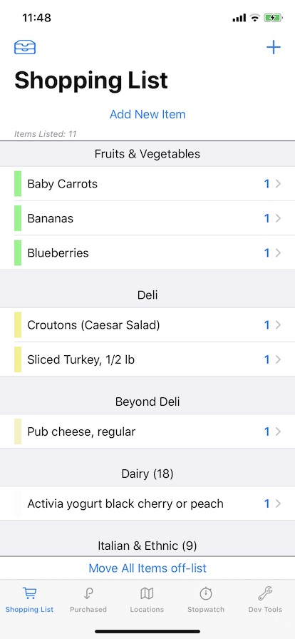
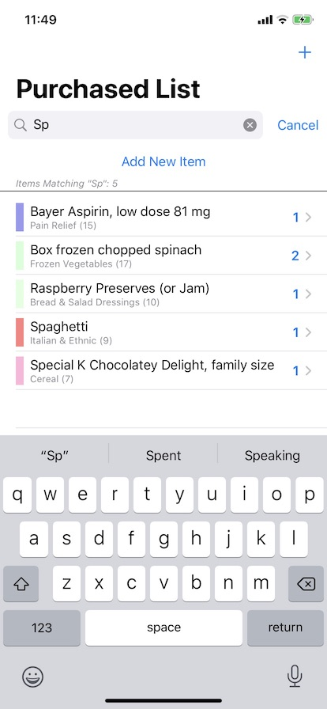
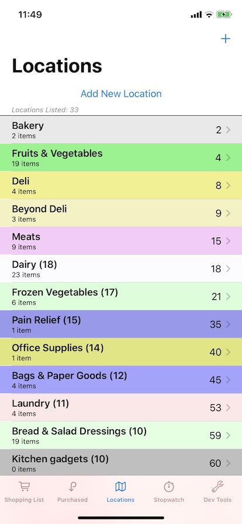

#  About "ShoppingList"

This is a simple, iOS project to process a shopping list that you can take to the grocery store with you, and move items off the list as you pick them up.  It persists data in CoreData.  This uses an MVVM-style architecture along with SwiftUI, so you must have iOS 13.0; and, of course, I would recommend using the latest version of iOS available, given that SwiftUI was such a new technology with the release of iOS 13.

* This project is stable and does pretty much work as I suggest, as of **XCode 11.7/iOS 13.7**.  

* If you use XCode 12, there are some slight changes needed to make this work right (*see below*).

Feel free to use this as is, to develop further,  to completely ignore, or even just to inspect and then send me a note to tell me I am doing this all wrong.  

## Update Available as of December 4, 2020

[An updated version of this project, retitled *ShoppingList14*, has been released](https://github.com/DelawareMathGuy/ShoppingList14). It incorporates some iOS 14 features, compiles with XCode12.2 and runs under iOS 14.2.  

**This project, ShoppingList, will no longer be updated.**

## Last Update of Note: October 7, 2020

As mentioned in my last update of note in late September, I have reverted to posting the project using XCode 11.7.  The only significant change at this time is a simple UI and operational change for moving items between the shopping list and the purchased items list: 

* You no longer swipe to "move to the other list," but instead I have placed little circular buttons to the left of items in the shopping list and in the purchased list to move an item to the other list. It turns out that i have gotten tired of swiping and tapping delete to do this (!) It's much easier just to tap (*on the leading edge*) and I also added a useful animation to the process.  As a result, i have removed .onDelete() modifiers throughout the code: there are no more swipes from the trailing edge (*in fact, Apple's HIGs basically say that a swipe from the trailing side means delete*).

If you do open this project with XCode 12,  you should be aware of some items:

* The iOS Deployment Target for this project is set at 13.0.  
* (*Identifiable conformance of Core Data classes*) In XCode 12, conformance of ShoppingItem and Location to Identifiable is automatically added in the code auto-generated by XCode.  You will receive *duplicate conformance* errors with this code.  Simply comment-out or remove the file IdentifiableConformance11.7.swift from the project.
* (*Behaviour change in lists*) Tapping on a list item when running iOS 14 selects the item and then follows a navigation link.  However, the list item is never unselected upon return.  This will stay as is for now (*there is no operational impact*).
* The code in SLSectionHeaderView.swift has several lines of code commented out so this will compile under XCode 11. The code will compile under XCode 12 as is, but you may want to reinstate those lines so that the code runs with a  section header appearance that you see  in iOS 13.
* (*ListStyle*) I have added an explicit `.listStyle(PlainListStyle())` modifier to some lists in the code, so that the iOS 14 presentation agrees with the iOS 13 presentation.  (*The iOS 14 default style is slightly different*.)
* (*@StateObject*) View models used in this app are maked as `@ObservedObject` and work fine as is, but should be marked `@StateObject` if running in iOS 14.  There are some cases in this app in iOS 13 where a view model might go away (when a SwiftUI view goes away) and be re-instantiated later; but since they are kept in sync with Core Data during their lifetime, there is no harm if they disappear and get re-instantiated later ... except for a negligible performance hit.

## General App Structure

    

    

The main screen is a TabView, to show 
* a current shopping list, 
* a (searchable) list of previously purchased items, 
* a list of "locations" in a store, such as "Dairy," "Fruits & Vegetables," "Deli," and so forth, 
* an in-store timer, to track how long it takes you to complete shopping, and
* optionally, for purposes of demonstration, a "Dev Tools" tab to make wholesale adjustments to the data and the shopping list display.

The CoreData model has only two entities named "ShoppingItem" and "Location," with every ShoppingItem having a to-one relationship to a Location (the inverse is to-many).

* `ShoppingItem`s have an id (UUID), a name, a quantity, a boolean "onList" that indicates whether the item is on the list for today's shopping exercise, or not on the list (and so available in the purchased list for future promotion to the shopping list), and also an "isAvailable" boolean that provides a strike-through appearance for the item when false (sometimes an item is on the list, but not available today, and I want to remember that when planning the future shopping list).    ShoppingItems originally had a visitationOrder that mirrored the visitationOrder of the Location to which they were assigned, but the current version of the code does not read or write  the value of this field (i.e., feel free to delete it from the Core Data model if you have not already built out a large database using previous versions of the code).

* `Location`s have an id (UUID), a name, a visitationOrder (an integer, as in, go to the dairy first, then the deli, then the canned vegetables, etc), and then values red, green, blue, opacity to define a color that is used to color every item listed in the shopping list. 

For the first two tabs, tapping on the circular button on the leading edge moves a shopping item from one list to the other list (from "on the list" to "purchased" and vice-versa).  

Tapping on any item (*not the leading circular button*) in either list lets you edit it for name, quantity, assign/edit the store location in which it is found, or even delete the item.  Long pressing on an item gives you a contextMenu to let you move items between lists, toggle between the item being available and not available, or directly delete the item.

The shopping list is sorted by the visitation order of the location in which it is found (and then alphabetically within each Location).  Items in the shopping list cannot be otherwise re-ordered, although all items in the same Location have the same color as a form of grouping.  Tapping on the leading icon in the navigation bar will toggle the display from a simple, one-section list, to a multi-section list.

The third tab shows a list of all locations, listed in visitationOrder (an integer from 1...100).  One special Location is the "Unknown Location," which serves as the default location for all new items.  I use this special location to mean that "I don't really know where this item is yet, but I'll figure it out at the store." In programming terms, this location has the highest of all visitationOrder values, so that it comes last in the list of Locations, and shopping items with this unassigned/unknown location will come at the bottom of the shopping list. 

Tapping on a Location in the list lets you edit location information, including reassigning the visitation order, change its color, or delete it.  (Individually adjusting RGB and Alpha may not the best UI in this app, but it will have to do for now.  Also, using color to distinguish different Locations may not even be a good UI, since a significant portion of users either cannot distinguish color or cannot choose visually compatible colors very well.)  You will also see a list of the ShoppingItems that are associated with this Location. A long press on a location (other than the "unknown location") will allow you to delete the location directly.

* What happens to ShoppingItems in a Location when the Location is deleted?  The ShoppingItems are not deleted, but are moved to the Unknown Location.

The fourth tab is an in-store timer, with three simple button controls: "Start," "Stop," and "Reset."  This timer can be (optionally) paused when the app goes inactive (e.g., if you get a phone call while you're shopping), although the default is to *not* pause it when going inactive. (*See Development.swift to change this behaviour*.)

Finally, there is a  tab for "development-only" purposes, that allows wholesale loading of sample data, removal of all data, and offloading data for later use. This tab should not appear in any production version of the app (*see Development.swift to hide this*).

So, 

* **If you plan to use this app**, the app will start with an empty shopping list and an almost-empty location list (it will contain the special "Unknown Location"); from there you can create your own shopping items and locations associated with those items.  

* **If you plan to play with or just test out this app**, go straight to the Dev Tools tab and tap the "Load Sample Data" button.  Now you can play with the app, and eventually delete the data (also from the Dev Tools tab) when you're finished.

## App Architecture Comment

Despite this app starting off with some simple @FetchRequest definitions and making some lists, this version makes no direct use of @FetchRequest or even Combine. I have *gone completely old-school*, just like I would have built this app using UIKit, before there was SwiftUI and Combine. 

* I post internal notifications through the NotificationCenter that a `ShoppingItem` or a `Location` has either been created, or edited, or is about to be deleted.  (Remember, notifications are essentially a form of using the more general Combine framework.) Every view model loads its data only once from Core Data and signs up for appropriate notifications to stay in-sync without additional fetches from Core Data.  Each view model can then react accordingly, alerting SwiftUI so that the associated View needs to be updated.  This design suits my needs, but may not be necessary for your own projects, for which straightforward use of @FetchRequest might well be sufficient.

## Future Work

Although this is the last, public release of the project, there are many directions to move with this code.

* I'd like to look at CloudKit support for the database for my own use, although such a development  could return to public view if I run into trouble and have to ask for help.  The general theory is that you just replace NSPersistentContainer with NSPersistentCloudkitContainer, flip a few switches in the project, add the right entitlements, and off you go. *I doubt that is truly the case*, and certainly there will be a collection of new issues that arise.

* I should invest a little time with iPadOS.  Unfortunately, my iPad 2 is stuck in iOS 9, so it's not important to me right now.  As a future option, though -- even though you probably don't want to drag an iPad around in the store with you -- you might want to use it to update the day's shopping list and then, via the cloud, have those changes show up on your phone to use in-store.

*  I still get console messages at runtime about tables laying out outside the view hierarchy, and one that's come up recently of "Trying to pop to a missing destination." I see fewer of these messages in XCode 11.7.  When using contextMenus, I get a plenty of "Unable to simultaneously satisfy constraints" messages.  I'm ignoring them for now, and I have already seen fewer or none of these in testing out XCode 12 (through beta 6). 

* I have thought about expanding the app and database to support multiple "Stores," each of which has "Locations," and having "ShoppingItems" being many-to-many with Locations so one item can be available in many Stores would be a nice exercise. But I have worked with Core Data several times, and I don't see that I gain anything more in the way of learning about SwiftUI by doing this, so I doubt that I'll pursue this any time soon.

* I could add a printing capability, or even a general sharing capability (e.g., email the shopping list to someone else).  I did something like this in another (*UI-Kit based*) project, so it should be easy, right?  (Fact: it is easy; there are several "mail views for SwiftUI" already on Github. [This is one from Mohammad Rahchamani](https://github.com/mohammad-rahchamani/MailView) that I have tested and it works quite easily for any SwiftUI app.)

Note that I am certainly not at all interested in creating the next, killer shopping list app or moving any of this to the App Store.  *The world really does not need a new list-making app*.  
But, if you want to take this code and run with it ... go right ahead.

##  View Updating Issues

I built this project in public only as an experiment, in order to simply get a lot of practice with SwiftUI, and to look more deeply and perhaps offer some suggested code to the folks who keep running into what I call SwiftUI's **generic problem**:

> An item appears in View A; it is edited in View B (a detail view that appears either by a NavigationLink or a .sheet presentation); but its appearance in View A does not get updated properly upon return.  

SwiftUI does a lot of the updating for you automatically, but the situation is more tricky when using Core Data because the model data consists of objects (classes), not structs.  SwiftUI does provide @FetchRequest and @ObservedObject and @EnvironmentObject (and Combine if you go deeper), but the updating problem is not completely solved just by sprinkling @ObservedObject property wrappers around in your code. It also matters in SwiftUI whether you pass around structs or classes between SwiftUI Views, and exactly how you pass them.  

Indeed, the biggest issue that I found in the early days of this app involved updates following a **deletion** of a Core Data object.  My conclusion is that @FetchRequest and SwiftUI don't always interact that well with respect to deletions, and that is what drove me to the architecture and my reliance on using the NotificationCenter that you will find in the app. (*I have extensive comments in the code about the problems I faced*).

* I think that my current use of notifications and "view models" in place of @FetchRequest provides a solution to much of the **generic problem** in the distributed SwiftUI situation that occurs in *this* app.  It works for me; you must decide if any of this is something that might work for you.

## Closing

The project is what it is -- a project that began trying to learn how to use SwiftUI with a Core Data store. On a basic level, understanding the SwiftUI lifecycle of how Views come and go turned out to be a major undertaking.  On the Core Data side, using @FetchRequest was the obvious, right thing -- until it wasn't.  Then adding a few sprinkles of Combine looked like the right thing -- until it wasn't.  I learned a lot ... and that was the point of this project.

Feel free to contact me about questions and comments.

## License

* The SearchBarView in the Purchased items view was created by Simon Ng.  It appeared in [an article in AppCoda](https://www.appcoda.com/swiftui-search-bar/) and is copyright ©2020 by AppCoda. You can find it on GitHub under AppCoda/SwiftUISearchBar. 
* The app icon was created by Wes Breazell from [the Noun Project](https://thenounproject.com). 
* The extension I use on Bundle to load JSON files is due to Paul Hudson (@twostraws, [hackingwithswift.com](https://hackingwithswift.com)) 

Otherwise, almost all of the code is original,  and it's yours if you want it -- please see LICENSE for the usual details and disclaimers.

